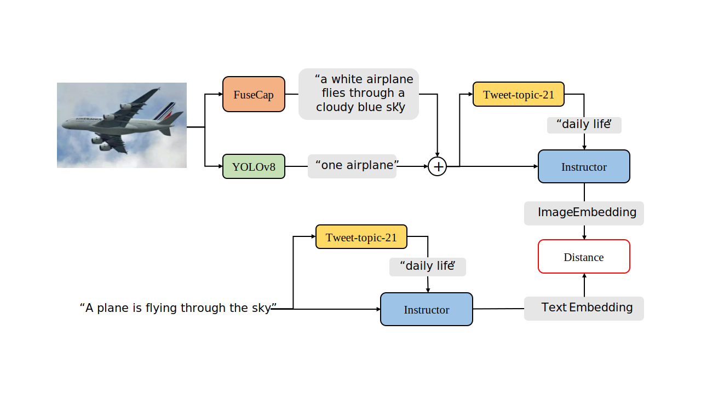
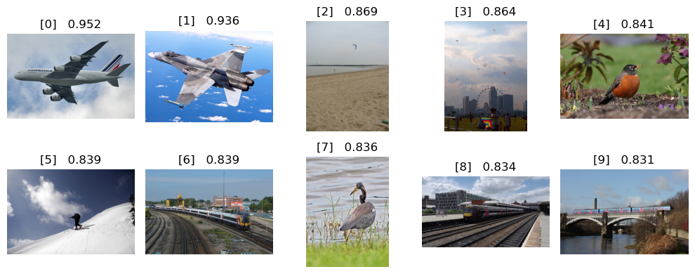
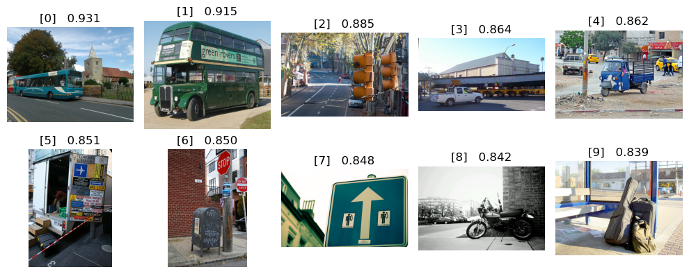

# 图像检索系统



这是一个非常缝合的图像——文本检索框架，核心是通过对图像内容产生描述，再使用描述文本的相似性计算符合条件的图片。优点有：

- 即开即用，各个网络之间无需训练即可搭配使用。
- 在图像描述中可以手动加入自定义文本，使图像检索可以考虑在图像中无法识别的信息。
- 结合了图像字幕、目标检测、文本分类和文本嵌入模型，效果还可以。


## 模块

### 图像字幕模型

图像字幕模型负责对图像内容产生文本描述，在框架中发挥最主要作用。这里使用了[noamrot/FuseCap_Image_Captioning](https://hf-mirror.com/noamrot/FuseCap_Image_Captioning)模型，了解更多：

>
>
>Rotstein, Noam, et al. "FuseCap: Leveraging Large Language Models to Fuse Visual Data into Enriched Image Captions." *arXiv preprint arXiv:2305.17718* (2023).

### 目标检测模型

目标检测模型负责检测图像中存在的目标物体，在框架中对产生的图像字幕进行补充，主要是强调物体的数量关系，防止图像字幕遗漏元素或者搞错数目。这里使用了[ultralytics/YOLOv8](https://github.com/ultralytics/ultralytics)模型，了解更多：

>
>
>Jocher, G., Chaurasia, A., & Qiu, J. (2023). Ultralytics YOLO (Version 8.0.0) [Computer software]. https://github.com/ultralytics/ultralytics

### 文本分类模型

文本分类模型负责对图像字幕和目标检测所产生的图像综合描述内容进行分类，所产生的文本类别会参与后续文本嵌入中作为引导线索，提升文本嵌入的精确度。这里使用了[cardiffnlp/tweet-topic-21-multi](https://hf-mirror.com/cardiffnlp/tweet-topic-21-multi)模型，可以将文本进行21个类别的判别，了解更多：

>
>
>Antypas, Dimosthenis, et al. "Twitter topic classification." *arXiv preprint arXiv:2209.09824* (2022).

### 文本嵌入模型

文本嵌入模型负责将文本转换为特征向量，是计算文本相似性的最重要环节。这里使用了[hkunlp/instructor-large](https://hf-mirror.com/hkunlp/instructor-large)模型，依据instruction和sentence两个参数，在本框架中将图像综合描述作为sentence，将文本类别作为introduction进行编码计算得到特征向量。了解更多：

>
>
>Su, Hongjin, et al. "One embedder, any task: Instruction-finetuned text embeddings." *arXiv preprint arXiv:2212.09741* (2022).


## 环境

```
torch==1.13.1
numpy==1.21.6
matplotlib==3.5.3
transformers==4.31.0
scipy==1.7.3
ultralytics==8.0.228
tqdm==4.66.1
```

在`models/`中还需要手动新建`cardiffnlp/tweet-topic-21-multi/`和`noamrot/FuseCap/`两个目录，并从HF/HF-mirror的仓库中下载模型配置文件：

- [Tweet-Topic-21](https://hf-mirror.com/cardiffnlp/tweet-topic-21-multi/tree/main)
- [FuseCap](https://hf-mirror.com/noamrot/FuseCap_Image_Captioning/tree/main)

将`config.json` `pytorch_model.bin` `tokenizer.json` 等文件移动到对应目录下。


## 使用

**检查模块可用性** 使用`test_utils.ipynb`可以检查各个模型是否已经正确部署。

**建立图像特征索引** 使用`build_index.ipynb`可以对`gallery/`内的`.jpg`图像文件搭建特征索引，结果会保存至`tmp/`中。

**图像检索** 使用`retrieval_image.ipynb`可以检索图像（需要先建立图像特征索引）。


## 示例

```
a plane flying in the sky .
```



```
a bus in the street .
```

